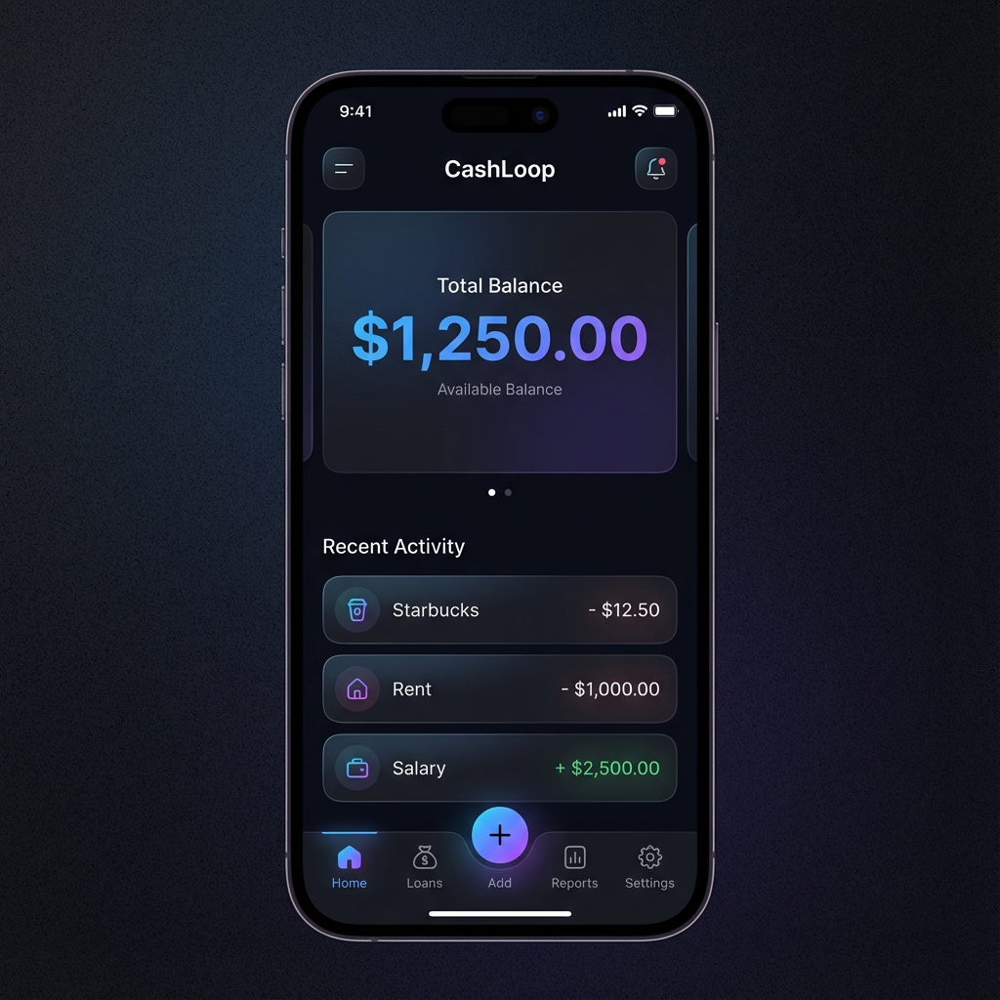
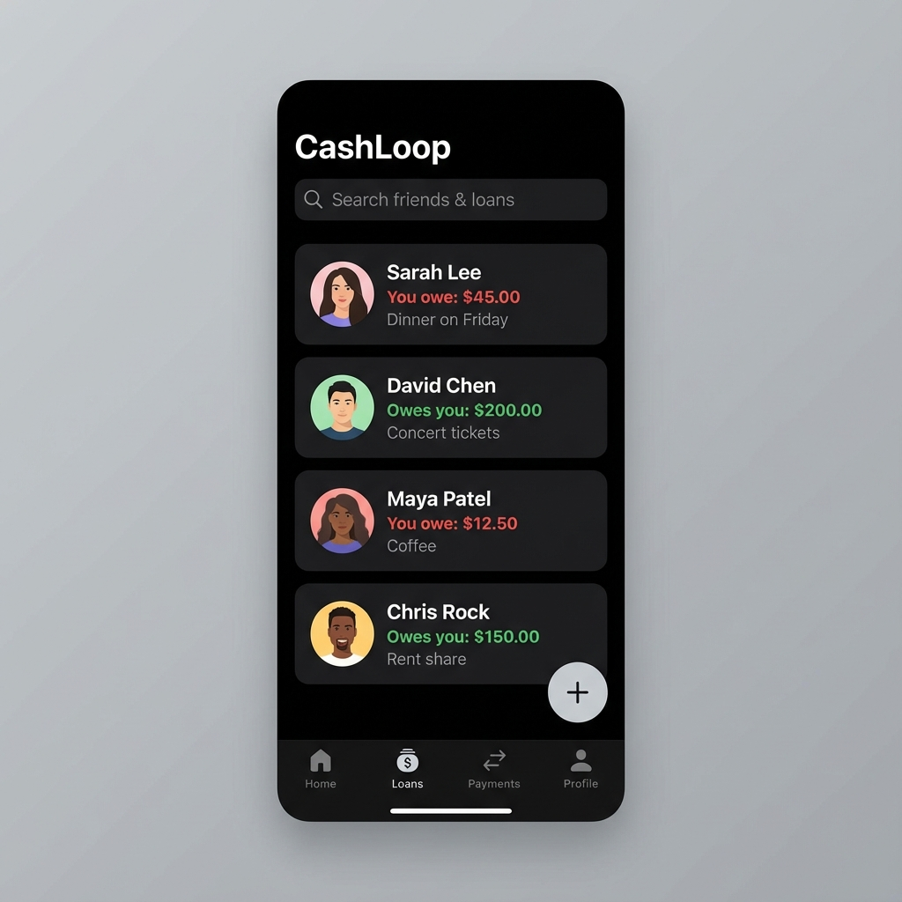
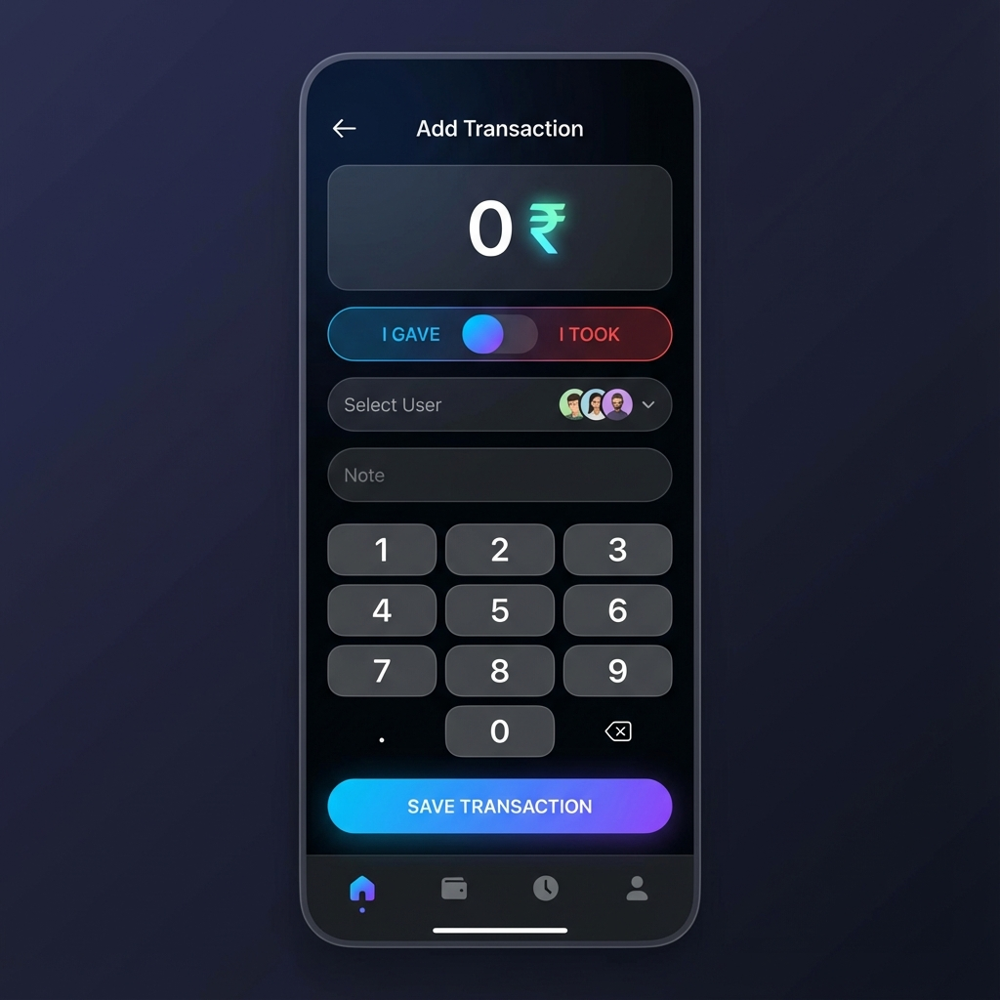

# CashLoop 💸


> **Smart Financial Management for the Modern Era.**  
> Track loans, manage cash flow, and gain AI-powered insights into your finances with a beautiful, fluid interface.

[](https://opensource.org/licenses/MIT)
[](https://expo.dev)
[](https://reactnative.dev)
[](https://supabase.com)
[](https://www.typescriptlang.org/)

## 🌟 Introduction

**CashLoop** is a cutting-edge financial management application designed to simplify how you track money. Whether it's lending to friends, borrowing for emergencies, or just keeping tabs on your daily cash flow, CashLoop provides a seamless, secure, and aesthetically pleasing experience.

Built with **React Native** and **Expo**, and powered by **Supabase**, CashLoop offers real-time synchronization, offline capabilities, and a stunning UI that makes finance fun.

## ✨ Key Features

- **💸 Loan Tracking**: Keep track of who owes you and who you owe. Never forget a debt again.
- **🔄 Cash Flow Management**: Record income and expenses with ease.
- **🤖 AI Insights**: (Coming Soon) Smart analysis of your spending habits.
- **🔐 Secure & Private**: Your data is safe with Supabase authentication and Row Level Security.
- **🎨 Premium UI/UX**: Smooth animations with `Moti` and `Reanimated`, glassmorphism effects, and haptic feedback.
- **☁️ Cloud Sync**: Real-time synchronization across devices.
- **📱 Cross-Platform**: Works seamlessly on Android and iOS.

## 🛠️ Tech Stack

- **Frontend**: React Native, Expo, TypeScript
- **Routing**: Expo Router
- **Styling**: Native Styles, Expo Linear Gradient, Expo Blur
- **Animations**: React Native Reanimated, Moti
- **Icons**: Expo Symbols, Ionicons
- **Backend**: Supabase (PostgreSQL, Auth)
- **Fonts**: Outfit (Google Fonts)

## 📸 Screenshots

| Home Screen | Loans | Add Transaction |
|:---:|:---:|:---:|
|  |  |  |

> *Note: Screenshots are placeholders. Please add actual screenshots to `assets/screenshots/`.*

## 🚀 Getting Started

### Prerequisites

- [Node.js](https://nodejs.org/) (v18 or newer)
- [npm](https://www.npmjs.com/) or [yarn](https://yarnpkg.com/)
- [Expo Go](https://expo.dev/client) app on your mobile device.

### Installation

1.  **Clone the repository:**
    ```bash
    git clone https://github.com/Rajesh161718/cashloop.git
    cd cashloop
    ```

2.  **Install dependencies:**
    ```bash
    npm install
    ```

3.  **Set up Environment Variables:**
    Create a `.env` file in the root directory and add your Supabase credentials:
    ```env
    EXPO_PUBLIC_SUPABASE_URL=your_supabase_url
    EXPO_PUBLIC_SUPABASE_ANON_KEY=your_supabase_anon_key
    ```

4.  **Run the app:**
    ```bash
    npx expo start
    ```

5.  **Scan the QR code** with the Expo Go app on your phone.

## 🤝 Contributing

We welcome contributions! Please see our [CONTRIBUTING.md](CONTRIBUTING.md) for details on how to get started.

## 📄 License

This project is licensed under the MIT License - see the [LICENSE](LICENSE) file for details.

## 🛡️ Security

For security concerns, please review our [Security Policy](SECURITY.md).

---

Made with ❤️ by Rajesh Biswal.
